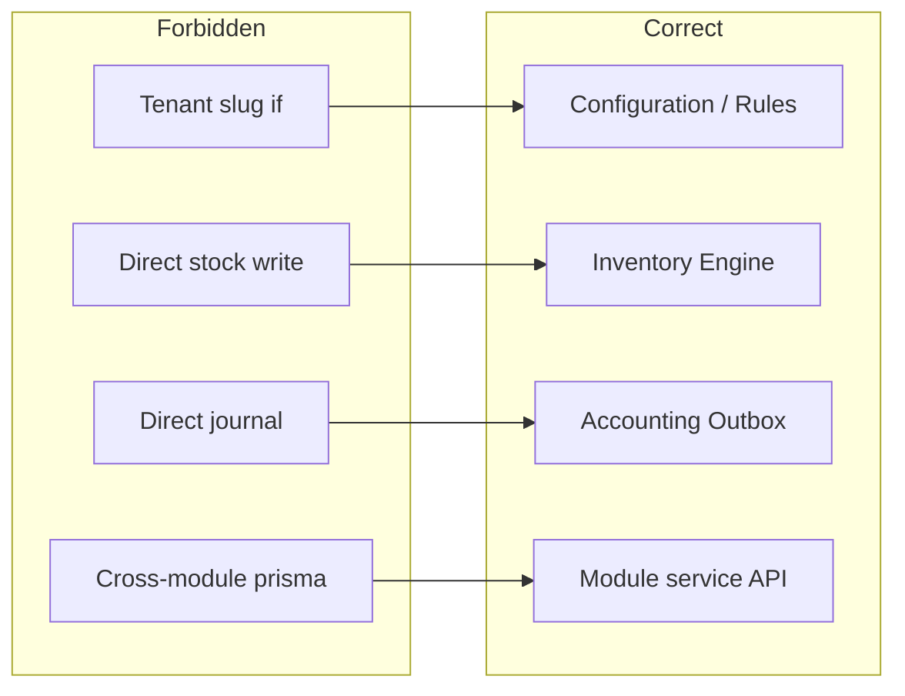
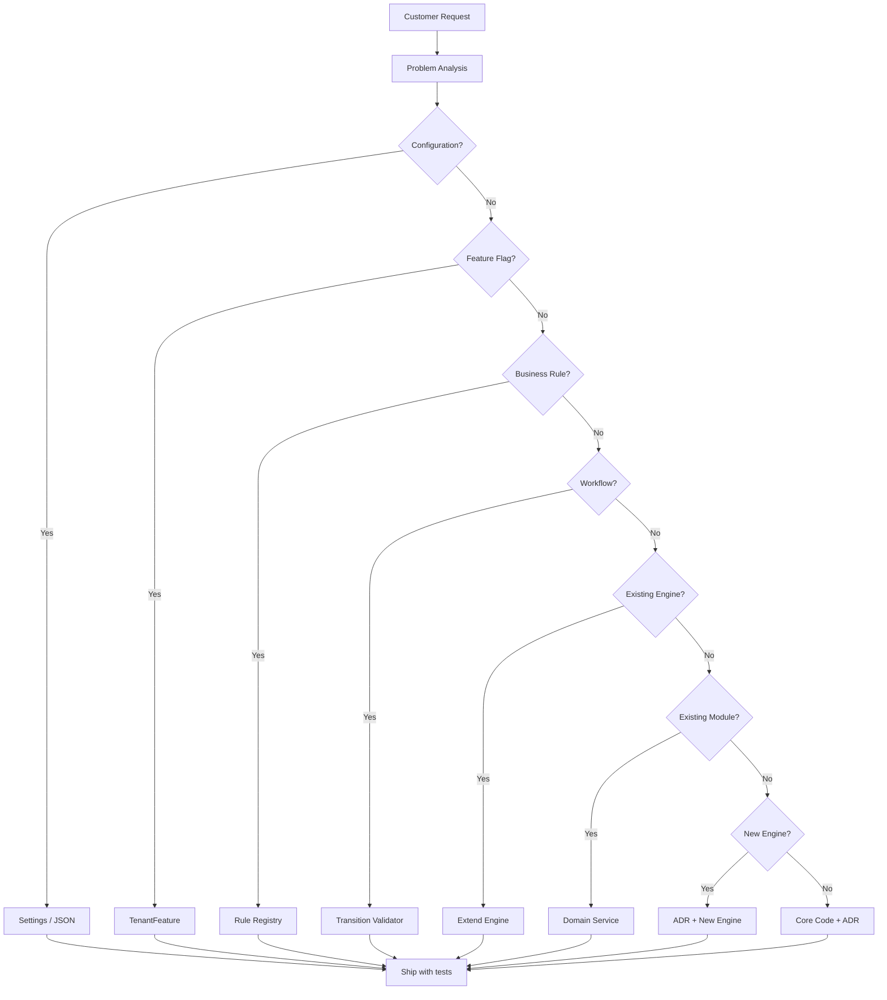
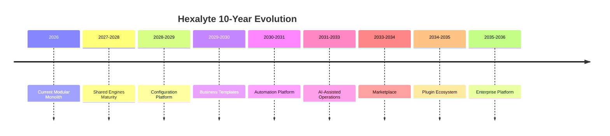
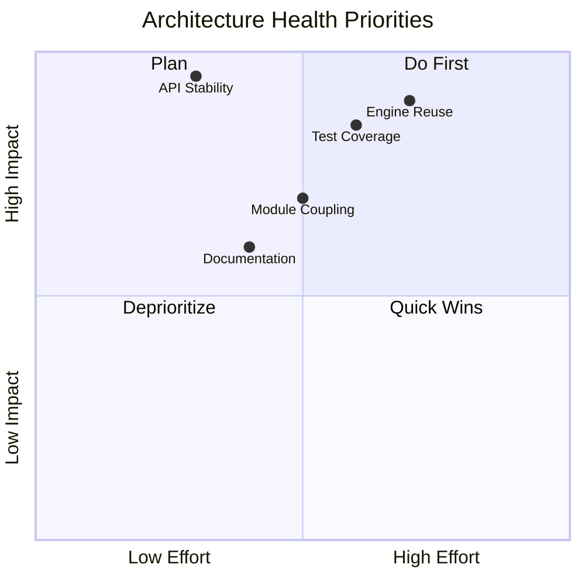

# Hexalyte Enterprise Platform Architecture Blueprint (10-Year Engineering Bible)

> **Purpose:** This document is the official onboarding guide and long-term architectural reference for the Hexalyte engineering team.
>
> **Non-goals:** Do not redesign the system, replace modules, change database schema without additive safety, or replace APIs without explicit backward-compat strategy.
>
> **Primary directive:** Every recommendation prioritizes long-term maintainability, reusability, stability, and backward compatibility over short-term convenience.

---
## Document governance (how this stays correct for 10 years)

### Source of truth
- **Implementation truth:** runtime code is the source of truth (as implemented, not aspirational).
- **Architecture docs:** this document + `docs/ARCHITECTURE.md` + module-level docs (when present).

### Versioning model
- This file is versioned by `## Revision` blocks (no external tooling required).
- Each revision includes:
  - Date
  - Author
  - Scope of changes
  - Backward compatibility impact
  - Validation notes (tests run / verification done)

### Change control rules
1. **No behavior-changing proposals without an explicit RFC.**
2. **API contracts are immutable unless additive.**
3. **Engine extractions are behind feature flags** (tenant-scoped) and default OFF.
4. **All “move into engines” proposals must prove duplicated logic exists** in current code paths.
5. **Every change must include a migration strategy** (including rollback).

---
## 0) Reference baseline

This blueprint assumes the current Hexalyte architecture as described in:
- `docs/ARCHITECTURE.md`
- `apps/backend/src/app.ts` (route mounts)
- `apps/backend/prisma/schema.prisma` (data model)
- `apps/backend/src/middleware/*` (auth, branch scoping, validation, error handling)

---
## 1) Current Architecture Analysis (what exists today)

### 1.1 System topology and layers
Hexalyte is a modular monolith multi-tenant SaaS:
- **apps/web** (tenant UI + POS)
- **apps/admin** (platform operator control plane)
- **apps/backend** (Express REST API under `/api/v1` and platform admin endpoints under `/admin/v1`)
- **PostgreSQL** with row-level isolation by `tenantId`
- **Redis** for JWT blacklist/rate limits/sessions

Branch scoping is implemented by request headers and middleware (active branch resolution).

### 1.2 Multi-tenancy
- Every business row carries `tenantId`.
- Every request is scoped by tenant identity and branch context.
- Tenant feature flags are stored in `TenantFeature` and evaluated with opt-in defaults.

### 1.3 Core shared cross-cutting concerns
Shared concerns exist today as:
- Pagination (`utils/pagination`)
- Branch scoping (`utils/active-branch`)
- Tenant access checks (`utils/tenant-access`)
- Zod validation (`middleware/validate.middleware.ts`)
- Outbox integration and idempotency linking (`AccountingOutbox`, `IntegrationLink`)

---
## 2) Platform Philosophy (Non-Negotiable Rules)

These rules must be followed for every new feature and every incremental evolution:

1. **Modular Monolith + Engines:** Domain modules own aggregates and invariants; engines own standardized cross-cutting side effects.
2. **Engines do not replace domain aggregates:** Engines execute standardized procedures; they do not redefine the domain model.
3. **Read/write boundaries:** Prefer read composition in modules and report utilities; prefer write execution through standardized engines or module services that call engines.
4. **Tenant and branch safety is mandatory:** No bypassing tenant/branch enforcement. Engines and module services must accept explicit scoped inputs rather than re-deriving unsafely.
5. **Defaults equal current behavior:** Any evolution is opt-in via feature flags/tenant config, validated with tests, and must preserve backward compatibility.
6. **Idempotency is a platform requirement:** Outbox and integration side effects must be idempotent using `IntegrationLink`.
7. **Configuration > conditionals:** Hardcoded variations must be moved to tenant feature flags, configuration JSON, Business Rules, or Workflow configuration with defaults matching today.
8. **Compatibility-first evolution:** API response shapes are additive only; DB changes are additive and backfill-safe.

---
## 3) Platform Layers & Core Platform Boundaries

### 3.1 Conceptual platform layers
1. **Presentation:** UI components/pages/modals (apps/web + apps/admin).
2. **API/Application:** Express routers and request handlers (HTTP contracts).
3. **Domain Modules:** Sale, PO, RepairTicket, Product, Customer, Supplier, etc.
4. **Shared Engines:** standardized procedures with stable input/output contracts.
5. **Persistence:** Prisma + DB schema.
6. **Integration/Async:** outbox processing, external providers (Keycloak, WhatsApp), exports adapters.

### 3.2 Dependency direction rules (enforced by code review)
- Presentation may call API only.
- API/Application calls Domain Modules.
- Domain Modules may call Engines (when standardized side effects are needed).
- Engines may call shared utilities and persistence, but **must not depend on UI**.
- Cross-domain coupling must be mediated by engines, events, or report utilities—not direct module-to-module deep calls.

---
## 4) Shared Reusable Engines (contracts, hierarchy, boundaries)

### 4.1 Engine hierarchy
- **Primary side-effect engines (high centrality):**
  - Inventory Engine (stock + stock movements + IMEI status updates)
  - Accounting Engine (outbox enqueue + outbox processing + journal posting)
- **Primary read/report engines:**
  - Report Engine (filter context + standardized pagination)
- **Supporting engines (read-only or standardization):**
  - Pricing Engine
  - Configuration Engine
  - Validation Engine (cross-entity validation utilities; not replacing Zod)
  - Workflow Validators (transition checking only)
  - Template Engine (document and label rendering inputs)
  - Audit Engine (optional consolidation; read/write discipline)
  - Notification Engine (dispatch adapters)
  - Search Engine (only if duplication requires; otherwise query composition stays in report utilities)

### 4.2 Engine Specification Template (required for every engine)
Every engine must be documented with the following contract:
- **Purpose**
- **Responsibilities**
- **Inputs** (explicit params; no hidden request derivation)
- **Outputs** (return payload + side effects)
- **Dependencies** (engines/modules/utilities it may call)
- **Consumers** (which modules call it)
- **Must not do** (non-goals and strict prohibitions)
- **Future extensibility** (additive extension points)

### 4.3 Engine contracts (current set and governance)

#### 4.3.1 Inventory Engine
- **Purpose:** Single standardized write path for stock mutations, stock movement records, and IMEI status updates.
- **Responsibilities:**
  - Apply quantity deltas (including variant stock via `storageVariations`)
  - Create consistent `StockMovement` rows with deterministic reference/note rules
  - Update `ImeiRecord` statuses for sale/return/transfer/receive flows
  - Enforce tenant/branch constraints on mutations
- **Inputs:** tenantId, branchId(s), productId(s), quantityDelta(s), reference, note, performedBy, optional variantKey/IMEI updates
- **Outputs:** updated aggregate state and created movement identifiers
- **Dependencies:** product-variants utilities; existing PO receive helpers (delegated); IMEI update helpers
- **Consumers:** sales, PO receive, stock transfer, repairs spare parts, exchanges, returns
- **Must not do:** accounting classification logic; document rendering
- **Future extensibility:** costing method variants, configurable movement note templates
- **Migration strategy:** wrap current flows; enable behind feature flag; keep old behavior as delegate until stable

#### 4.3.2 Accounting Engine (Outbox + Auto Journal)
- **Purpose:** Reliable operational-to-GL integration via outbox + idempotent posting.
- **Responsibilities:**
  - Enqueue outbox items
  - Process outbox items deterministically
  - Build journal lines using reader templates and GL mappings
  - Enforce accounting periods and balancing rules
- **Inputs:** tenantId, event catalog entries
- **Outputs:** JournalEntry identifiers, IntegrationLink records
- **Dependencies:** auto-journal.engine.ts, journal-create service, source-readers
- **Consumers:** sales, repairs, suppliers, daily-closing, finance, opening balances
- **Must not do:** operational stock writes
- **Future extensibility:** more AutoJournalRule usage (configurable mappings)
- **Migration strategy:** additive expansion via new event types and readers

#### 4.3.3 Pricing Engine
- **Purpose:** Resolve retail/wholesale/credit pricing consistently across POS and validations.
- **Responsibilities:** mode-based unit price resolution, feature-flag awareness, optional overrides.
- **Inputs:** product/variant snapshot, pricing mode, optional manual override
- **Outputs:** unitPrice, optional margin metadata for UI
- **Dependencies:** product fields, tenant feature flags
- **Consumers:** POS overlay, sale validation, invoice itemization
- **Must not do:** UI changes; accounting computations
- **Future extensibility:** tenant pricing rules without code changes

#### 4.3.4 Configuration Engine
- **Purpose:** Normalize reads/writes of tenant JSON configuration with defaults and validation.
- **Responsibilities:** merge defaults, validate on write, optional TTL cache, invalidate caches on update.
- **Inputs:** tenantId, settings domain key
- **Outputs:** merged settings object
- **Dependencies:** tenant JSON storage; Zod schemas
- **Consumers:** all modules requiring tenant settings
- **Must not do:** change business outcomes without explicit tenant opt-in
- **Future extensibility:** settings aggregation endpoints

#### 4.3.5 Validation Engine (cross-entity utilities)
- **Purpose:** Provide reusable validation functions used by modules before writing.
- **Responsibilities:** stock availability checks, branch access checks, credit limit checks where applicable.
- **Inputs:** tenantId, branch context, entity ids, intended operations
- **Outputs:** either `OK` or typed decision errors
- **Dependencies:** active-branch, product availability helpers
- **Consumers:** sales, PO receive, transfers, supplier payment allocations
- **Must not do:** persistence writes
- **Future extensibility:** rule-backed validation once Business Rules engine is finalized

#### 4.3.6 Workflow Validators (transition checks)
- **Purpose:** Validate allowed state transitions without executing side effects.
- **Responsibilities:** enforce state graphs for RepairTicket and PurchaseOrder lifecycles.
- **Inputs:** entityType, from, to, context
- **Outputs:** boolean + optional explanation; errors as typed exceptions
- **Dependencies:** enums canonical truth
- **Consumers:** repairs.service.ts, suppliers/PO service
- **Must not do:** DB updates; side effects

#### 4.3.7 Report Engine
- **Purpose:** Standardized read model composition for analytics/report pages.
- **Responsibilities:** apply consistent filter context (date range, branch scope), enforce pagination invariants, prepare export metadata.
- **Inputs:** tenantId, filter context, pagination params
- **Outputs:** `{ data, total, page, limit }` + optional export metadata
- **Dependencies:** pagination + filter utilities
- **Consumers:** analytics, finance reports, product traceability exports
- **Must not do:** writes

#### 4.3.8 Template Engine
- **Purpose:** Render invoice/receipts/labels from `invoiceSettings`-driven templates.
- **Responsibilities:** template registry, variable binding contract, layout invariants.
- **Inputs:** template key + domain payload
- **Outputs:** HTML strings or structured render output used by existing export/print flows
- **Dependencies:** `invoiceSettings` JSON
- **Consumers:** sales prints, PO labels, warranty certificates
- **Must not do:** domain mutations

#### 4.3.9 Audit Engine (optional consolidation)
- **Purpose:** Correlate actions across modules/engines for compliance and debugging.
- **Responsibilities:** structured audit event creation.
- **Inputs:** actor, entity, before/after diffs, correlation ids
- **Outputs:** audit record ids
- **Dependencies:** existing AuditEvent model and/or StockMovement logs
- **Consumers:** all write paths incrementally
- **Must not do:** business logic changes

#### 4.3.10 Notification Engine (dispatch adapters)
- **Purpose:** Centralize “when something happens, notify via channel X”.
- **Responsibilities:** recipient resolution + channel adapter dispatch.
- **Inputs:** event type + payload + recipient set
- **Outputs:** adapter-specific message ids
- **Dependencies:** existing notification tables and WhatsApp integration
- **Consumers:** sales/suppliers/repairs/warranty completion
- **Must not do:** template rendering UI; DB mutations beyond audit/notification logs

---
## 5) Event-Driven Architecture (platform-wide model)

### 5.1 Event taxonomy
To ensure long-term traceability:
1. **Domain Events:** in-module facts (e.g., `SaleCreated`, `POReceived`).
2. **Integration Events:** cross-system facts that may create outbox items (e.g., accounting postings).

### 5.2 Outbox reliability contract (idempotency)
Existing design is the platform reference:
- **AccountingOutbox** stores pending integration work.
- **IntegrationLink** dedupes by `(tenantId, sourceType, sourceId, eventType)` (composite uniqueness).
- Events must include:
  - `sourceModule`
  - `sourceRefType`
  - `sourceRefId`
  - `sourceEvent`

### 5.3 Event versioning
For additive compatibility:
- When changing payload shape, use versioned event types or support both readers in parallel.
- Never remove required fields without transitional support.

---
## 6) Business Modules (module contract discipline)

Every module must document (in code comments or a module doc):
1. **Current responsibility**
2. **Future responsibility**
3. **Engine dependencies** (which engines it calls)
4. **Configuration points** (feature flags/settings)
5. **Workflow usage** (which transition validator, if any)
6. **Business rule usage** (rule keys; no magic strings)
7. **Events produced** (domain events; integration events via emit wrappers)
8. **Events consumed** (if module subscribes via outbox/readers)

### Module boundaries (strict)
- No module should directly implement stock/accounting side effects in a way that bypasses standard engines (once engines are extracted).
- No module should embed tenant-specific logic as hardcoded string comparisons; use Business Rules/Configuration.

---
## 7) Business Templates (documents, labels, exports)

Hexalyte’s template strategy is document-based and tenant-driven:
- `Tenant.invoiceSettings` JSON drives layout for receipts, A4 invoices, barcode label formats.
- Template Engine must treat template keys as stable identifiers.
- Exports (Excel/PDF/Print) are adapter outputs, not domain logic.

Backward compatibility rules:
- New template fields must be optional and default to current behavior.
- Template rendering should tolerate missing fields.

---
## 8) Configuration Strategy (no behavior changes without explicit opt-in)

### 8.1 Configuration sources
- `TenantFeature` toggles module enablement
- Tenant JSON settings (`invoiceSettings`, `reloadSettings`, `productVariantSettings`, etc.)
- Accounting settings (`AccountingSettings.defaultAccounts`, etc.)

### 8.2 Replacement for hardcoded logic
When a behavior differs by tenant or branch:
- Prefer tenant feature flags
- Prefer JSON settings with validation
- If behavior is conditional/complex: prefer Business Rules catalog (read-only evaluation first)

---
## 9) Business Rules Strategy (catalogued, versioned, default-preserving)

### 9.1 Business rules governance
All hardcoded business conditions must eventually map to:
- a rule key
- an evaluation contract
- optional tenant override

### 9.2 Rule evaluation precedence
1. Tenant override (if enabled)
2. Feature flag override (if present)
3. Default implementation (current behavior)

### 9.3 Phase strategy
- Phase 1: registry + evaluation that mirrors existing hardcoded logic
- Phase 2: tenant overrides additive only
- Phase 3: expand rule coverage incrementally

---
## 10) Workflow Strategy (transition validation boundary)

### 10.1 Workflow validators (boundary)
- DB enums remain canonical truth.
- Workflow validator checks transitions and optionally enforces guards.
- Workflow engine does not execute side effects; modules execute side effects using engines.

---
## 11) Development Principles (maintainability-first)

### 11.1 Before code changes (mandatory checklist)
1. Can this be solved by Configuration?
2. Can this be solved by Feature Flags?
3. Can this be solved by Business Rules?
4. Can this be solved by Workflow Validators?
5. Can this be solved by Template changes?
6. Can this be solved by Automation/Outbox?
7. If none: core code change (must include migration + tests).

### 11.2 Engineering principles (stable)
- Modules own aggregates and invariants.
- Engines own standardized side effects.
- Defaults must preserve current behavior.
- Additive-only API changes.
- Idempotency for async side effects.

---
## 12) Engineering Standards (required coding + reliability rules)

### 12.1 Error handling standards
- Domain failures throw `AppError` with appropriate HTTP status.
- Validation failures come from Zod and must remain mapped to HTTP 422.
- Response shapes remain consistent with existing `sendSuccess/sendPaginated`.

### 12.2 Transactions
- Any multi-table write must use `prisma.$transaction`.
- Any engine that performs outbox enqueue must ensure idempotency via IntegrationLink logic.

### 12.3 Prisma + multi-tenancy safety
- Every Prisma write must include `tenantId` constraints or follow a safe relation path.
- Branch scoping must be enforced for reads and writes.

### 12.4 Logging + correlation
- Every request handler must attach correlation context:
  - `tenantId`
  - `branchId` (if present)
  - `actorEmail/userId`
  - `sourceEvent/sourceRef` for outbox
- Outbox items must be traceable to originating business actions.

### 12.5 Security baseline
- Never rely on frontend gating only.
- Use `authorize(...)` and `requirePermission(...)` server-side.
- Validate all inputs (Zod) and normalize dates/ranges safely.

### 12.6 Code ownership and duplication policy
- Duplication is acceptable short-term when it reduces coupling.
- Extract only when duplicated logic exceeds a threshold (or has proven defects).

---
## 13) Testing & Verification Strategy (platform regression protection)

### 13.1 Test layers
1. **Unit tests** (pure logic):
   - Business rule evaluation
   - Pricing resolution
   - Workflow transition validation
2. **Integration tests** (DB + Prisma):
   - Stock mutation creates expected `Product.stock` + `StockMovement` rows
   - PO receive updates variants + stock movement
   - IMEI status changes on sale/return/transfer
3. **Accounting idempotency tests:**
   - Re-processing same event does not create duplicate IntegrationLinks/journal entries
4. **API contract tests:**
   - Response shape invariants (`sendPaginated`, meta totals)

### 13.2 Verification gates before merge
- For engine extractions or accounting changes: run integration + idempotency tests
- For reporting/export changes: run contract tests and export smoke checks

---
## 14) Migration Plan (safe incremental evolution)

### 14.1 Backward compatibility rules
- Additive only: do not remove fields or alter meaning without transitional support.
- Engine extractions are behind tenant feature flags (default off).
- New endpoints must not break existing endpoints.

### 14.2 Phase model
1. Add documentation + constants + rule registries (no behavior change)
2. Wrap logic into new engines/services and delegate
3. Enable per tenant via feature flags
4. Expand coverage only after stable metrics and tests

---
## 15) Deployment, Rollout, and Versioning Strategy

### 15.1 Rollout rules
- Deploy API code first (backward compatible)
- Deploy DB migration second (additive)
- Enable engine/rules via feature flags gradually

### 15.2 Versioning strategy
- API versioning via additive routes under `/api/v1` (avoid breaking)
- Event versioning via handler support for multiple event versions during transition

### 15.3 Rollback strategy
- Feature flags provide rollback by turning off new behavior
- Data migrations are reversible by additive semantics (no destructive operations)

---
## 16) Future Evolution (10-year extension strategy)

### 16.1 What changes should look like
Every new capability must fit:
- Configuration/Feature flags first
- Business Rules for conditional logic
- Workflow validators for state transitions
- Engines for side effects
- Templates for documents
- Outbox/Automation for async processes

### 16.2 What is prohibited without explicit RFC
- Hardcoded tenant exceptions
- Bypassing centralized engines for stock/accounting side effects
- Removing existing response fields or altering payload semantics without migration support

---
## 18) Architectural Decision Records (ADR)

### 18.1 Purpose of ADR

An **Architectural Decision Record (ADR)** captures *why* a significant technical choice was made, not only *what* was built. For a 10-year platform, ADRs prevent:

- Repeated debates on settled decisions
- Silent erosion of architecture through undocumented shortcuts
- Onboarding friction (“why do we do it this way?”)

ADRs are **immutable once accepted**. If a decision changes, a **new ADR supersedes** the old one — the old record is never deleted.

**Storage location (recommended):** `docs/adr/ADR-NNN-short-title.md`

---

### 18.2 ADR numbering strategy

| Rule | Detail |
|------|--------|
| Format | `ADR-NNN` where NNN is zero-padded (001, 002, …) |
| Scope | Platform-wide or cross-module decisions only |
| Not required for | Bug fixes, UI tweaks, single-tenant hotfixes |
| Required for | New engines, auth changes, DB model changes, API contract changes, workflow changes |

**Categories (optional prefix in title):**
- `ADR-0xx` — Foundational architecture
- `ADR-1xx` — Engines and shared layers
- `ADR-2xx` — Integration and events
- `ADR-3xx` — Security and multi-tenancy
- `ADR-4xx` — Deprecations and migrations

---

### 18.3 ADR lifecycle

```
Proposed → Under Review → Accepted → [Superseded | Deprecated]
```

| Status | Meaning |
|--------|---------|
| **Proposed** | Draft; open for team review |
| **Under Review** | RFC discussion in progress |
| **Accepted** | Becomes binding architecture policy |
| **Superseded** | Replaced by a newer ADR (link both ways) |
| **Deprecated** | No longer recommended; migration path documented |

**Review cadence:** Every accepted ADR must include a **Future Review** date (typically 12–24 months). On review, either reaffirm or supersede.

---

### 18.4 ADR decision template

```markdown
# ADR-NNN: Title

**Status:** Proposed | Accepted | Superseded by ADR-XXX
**Date:** YYYY-MM-DD
**Authors:** Name(s)
**Reviewers:** Name(s)

## Context
What is the situation that requires a decision?

## Problem
What specific problem are we solving?

## Decision
What is the chosen approach?

## Alternatives Considered
What other options were evaluated and why were they rejected?

## Trade-offs
What do we gain and what do we sacrifice?

## Consequences
What becomes easier? What becomes harder? What must teams do differently?

## Future Review
When should this decision be re-evaluated? Under what conditions?
```

---

### 18.5 Sample ADRs (binding reference decisions)

#### ADR-001: Why Modular Monolith

**Status:** Accepted  
**Date:** 2026-07-20

**Context**  
Hexalyte serves thousands of tenant shops with POS, inventory, repairs, suppliers, finance, and optional GL accounting. The team is small relative to domain breadth. Operational complexity must remain manageable for 10+ years.

**Problem**  
Microservices would fragment transactions (sale + stock + accounting), increase deployment overhead, and multiply failure modes — without current scale justification.

**Decision**  
Adopt a **modular monolith**: one deployable backend (`apps/backend`) with clear domain modules (`sales`, `suppliers`, `repairs`, etc.) and shared engines for cross-cutting side effects.

**Alternatives Considered**
| Alternative | Why rejected |
|-------------|--------------|
| Microservices per domain | Cross-domain transactions (sale→stock→GL) require distributed sagas; team size cannot support ops burden |
| Schema-per-tenant | Migration and reporting complexity; current row-level `tenantId` works at scale |
| Serverless functions | Cold starts, transaction boundaries, and Prisma connection pooling unsuitable for POS latency |

**Trade-offs**
- ✅ Single transaction boundary for sale + stock + outbox
- ✅ One deployment pipeline
- ✅ Easier local development
- ❌ All modules share runtime; noisy neighbor possible (mitigated by rate limits)
- ❌ Must enforce module boundaries via code review, not network isolation

**Consequences**
- New features go into existing modules or new module folders under `src/modules/`
- Cross-module calls must use engines/events, not direct service imports across domains
- Horizontal scaling = replicate entire backend (acceptable at current scale)

**Future Review:** 2028-07-20 — Revisit if tenant count exceeds 5,000 active or p99 API latency degrades under monolith load.

---

#### ADR-002: Why Shared Engines

**Status:** Accepted  
**Date:** 2026-07-20

**Context**  
Stock mutations appear in sales, PO receive, returns, repairs, exchanges, and stock transfer. Accounting emissions appear in sales, repairs, suppliers, daily-closing, and opening balances. Logic is duplicated with subtle inconsistencies (reference formats, variant stock, IMEI updates).

**Problem**  
Duplicated side-effect logic causes production defects that are hard to trace: stock counts diverge from movements, IMEI status wrong after return, accounting double-posts.

**Decision**  
Extract **Shared Engines** with stable input/output contracts:
- **Inventory Engine** — all stock writes + `StockMovement` + IMEI status
- **Accounting Engine** — outbox enqueue + process + journal (already partially exists)
- Supporting engines: Pricing, Configuration, Report, Template, Validation, Workflow Validators

Modules **call engines**; engines do **not** replace domain aggregates.

**Alternatives Considered**
| Alternative | Why rejected |
|-------------|--------------|
| Shared utility functions only | No enforcement boundary; modules still inline stock writes |
| Event sourcing for inventory | Full rewrite; breaks backward compatibility |
| Database triggers for stock | Opaque, untestable, bypasses application invariants |

**Trade-offs**
- ✅ Single place to fix stock/accounting bugs
- ✅ Consistent audit trail (`StockMovement`, `IntegrationLink`)
- ❌ Initial extraction cost (mitigated by feature-flag rollout)
- ❌ Engine API must remain stable once adopted

**Consequences**
- New stock writes must go through Inventory Engine (once extracted)
- Engine contracts documented in Section 4 of this blueprint
- Extraction behind tenant feature flag until proven stable

**Future Review:** 2027-01-20 — After Inventory Engine covers sales + PO + returns.

---

#### ADR-003: Why Accounting Outbox

**Status:** Accepted  
**Date:** 2026-07-20

**Context**  
Operational modules (sales, repairs, suppliers) must post to GL when `ACCOUNTING` feature is enabled. Direct synchronous journal creation inside sale transactions risks partial failure, double posting, and blocks operational latency.

**Problem**  
Sale creation must succeed even if GL posting is temporarily unavailable. Retries must not create duplicate journals.

**Decision**  
Use **Transactional Outbox** pattern (already implemented):
1. Operational module commits business transaction
2. `emit*Accounting()` enqueues `AccountingOutbox` row (idempotent upsert)
3. `processAccountingOutbox()` processes asynchronously (or inline if `autoPostEnabled`)
4. `IntegrationLink` dedupes `(tenantId, sourceType, sourceId, eventType)`

**Alternatives Considered**
| Alternative | Why rejected |
|-------------|--------------|
| Synchronous journal in same TX | GL failure rolls back sale — unacceptable for POS |
| Message queue (RabbitMQ/Kafka) | Additional infra; outbox in Postgres sufficient at scale |
| Polling external ERP | Hexalyte owns GL; no external system |

**Trade-offs**
- ✅ Eventual consistency with guaranteed delivery
- ✅ Idempotent by design
- ✅ No extra message broker
- ❌ Slight delay before GL reflects operation (acceptable)
- ❌ Outbox processor must be monitored

**Consequences**
- All new monetary side effects must enqueue outbox, never write journals directly from modules
- New event types require reader + engine handler + IntegrationLink key
- Monitoring: track outbox `FAILED` count and `attempts`

**Future Review:** 2027-07-20 — Revisit async worker separation if outbox backlog exceeds SLA.

---

#### ADR-004: Why Configuration over Customization

**Status:** Accepted  
**Date:** 2026-07-20

**Context**  
Tenants request shop-specific behavior: invoice layouts, pricing modes, approval thresholds, reload commission rules, barcode formats. Custom code per tenant does not scale and creates unmaintainable forks.

**Problem**  
Hardcoding `if (tenant.slug === 'kasthuri')` or customer-specific branches in core modules destroys long-term stability.

**Decision**  
Prefer **Configuration over Customization**:
1. **TenantFeature** flags for module enablement
2. **Tenant JSON settings** (`invoiceSettings`, `reloadSettings`, etc.) with validated defaults
3. **Business Rules** catalog for conditional logic (Phase 2)
4. **Workflow configuration** for state transition graphs (Phase 3)

Defaults must equal current behavior when config is unset.

**Alternatives Considered**
| Alternative | Why rejected |
|-------------|--------------|
| Per-tenant code branches | Unmaintainable; untestable matrix |
| White-label forks | Deployment nightmare |
| Plugin runtime (Phase 1) | Premature; adapter pattern sufficient |

**Trade-offs**
- ✅ One codebase serves all tenants
- ✅ Tenant self-service for settings (invoice, labels)
- ❌ Configuration UI and validation investment required
- ❌ Complex rules may still need Business Rules engine

**Consequences**
- Forbidden: tenant slug conditionals in domain logic (see Chapter 19)
- New tenant-specific requests must map to config keys or rule keys
- Configuration Engine normalizes reads/writes (Section 4.3.4)

**Future Review:** 2028-01-20 — Assess Business Rules coverage vs remaining hardcoded conditionals.

---

#### ADR-005: Why Business Rules Engine

**Status:** Accepted  
**Date:** 2026-07-20

**Context**  
Hardcoded rules exist today: opening balance detection (`OPENING_BALANCE`), accounting skip lists, COGS bucket classification, credit return allocation. These are scattered as magic strings and conditionals.

**Problem**  
Rules change per tenant or regulation without code deploys. Undocumented conditionals cause regression when refactored.

**Decision**  
Introduce a **Business Rules Engine** (phased):
- **Phase 1:** Rule registry + evaluator that mirrors current hardcoded defaults (read-only)
- **Phase 2:** Optional tenant overrides in JSON (additive)
- **Phase 3:** Admin UI for rule management

Evaluation precedence: tenant override → feature flag → default implementation.

**Alternatives Considered**
| Alternative | Why rejected |
|-------------|--------------|
| Rules in database only | No type safety; hard to test |
| External rules engine (Drools) | Over-engineered for current team |
| Keep hardcoding | Does not scale; ADR-004 violated |

**Trade-offs**
- ✅ Rules testable in isolation
- ✅ Tenant differentiation without code deploy
- ❌ Indirection; debugging requires rule key tracing
- ❌ Must prevent rules from executing side effects in Phase 1

**Consequences**
- Magic strings move to `business-rules.constants.ts` then rule keys
- Modules call `evaluateRule(tenantId, key, context)` instead of inline if/else
- No behavior change until tenant explicitly overrides

**Future Review:** 2027-07-20 — After 10+ rules catalogued and covered by unit tests.

---

## 19) Architecture Anti-Patterns

> **Policy:** The following practices are **forbidden** in Hexalyte production code unless an explicit ADR documents an exception with rollback plan.

Each anti-pattern includes: why it is dangerous, the correct alternative, and a concrete example from the Hexalyte domain.

---

### 19.1 Customer-specific code

| | |
|--|--|
| **Why dangerous** | Creates unmaintainable forks; every deploy risks breaking one customer; tests cannot cover all branches |
| **Correct alternative** | Tenant configuration, Business Rules, or feature flags |
| **Example (forbidden)** | `if (tenant.slug === 'acme-shop') { discount = 0.15 }` in `sales.service.ts` |
| **Example (correct)** | `evaluateRule(tenantId, 'MAX_DISCOUNT_PERCENT', ctx)` or settings JSON |

---

### 19.2 Tenant slug conditions

| | |
|--|--|
| **Why dangerous** | Slugs change; logic is invisible to other tenants; violates multi-tenant fairness |
| **Correct alternative** | `TenantFeature` flag or tenant-scoped settings key |
| **Example (forbidden)** | `if (req.headers['x-tenant-id'] === 'premium-mobile') showWholesaleFields()` |
| **Example (correct)** | `useFeatureFlag('WHOLESALE_PRICING')` |

---

### 19.3 Direct stock updates

| | |
|--|--|
| **Why dangerous** | Missing `StockMovement` rows break traceability; variant stock desyncs; IMEI status inconsistent |
| **Correct alternative** | Inventory Engine (or delegated wrapper during migration) |
| **Example (forbidden)** | `await prisma.product.update({ data: { stock: { decrement: qty } } })` in sales without movement |
| **Example (correct)** | `inventoryEngine.applyDelta({ productId, quantity: -qty, type: 'SALE', reference: invoiceNumber })` |

---

### 19.4 Direct journal creation

| | |
|--|--|
| **Why dangerous** | Bypasses outbox idempotency; duplicate GL entries on retry; breaks IntegrationLink audit |
| **Correct alternative** | `emitSaleAccounting()` / outbox enqueue |
| **Example (forbidden)** | `await createPostedJournalEntry(...)` directly inside `POST /sales` handler |
| **Example (correct)** | `await emitSaleAccounting(tenantId, sale.id, branchId)` after sale commit |

---

### 19.5 Duplicate business logic

| | |
|--|--|
| **Why dangerous** | Fixes applied in one module miss others; behavior diverges silently |
| **Correct alternative** | Shared engine, shared util, or Business Rule |
| **Example (forbidden)** | Weighted average cost calculated separately in PO receive and sales COGS |
| **Example (correct)** | `weightedBuyingPrice()` in `po-receive.util.ts` used by both paths |

---

### 19.6 Duplicate validation

| | |
|--|--|
| **Why dangerous** | Frontend-only validation is bypassable; inconsistent server rules cause 500s vs 422s |
| **Correct alternative** | Zod schema on route + Validation Engine for cross-entity checks |
| **Example (forbidden)** | Stock availability checked only in POS UI before add-to-cart |
| **Example (correct)** | Zod on `POST /sales` + `validationEngine.assertStockAvailable(...)` in service |

---

### 19.7 Cross-module database access

| | |
|--|--|
| **Why dangerous** | Violates module boundaries; schema changes in one module break another; hidden coupling |
| **Correct alternative** | Call owning module's service or engine; use read models / report queries |
| **Example (forbidden)** | `repairs.service.ts` directly queries `prisma.sale.findMany` for unrelated reporting |
| **Example (correct)** | `salesService.getByCustomerId(...)` or Report Engine query |

---

### 19.8 Hardcoded workflows

| | |
|--|--|
| **Why dangerous** | Shops need different repair/PO flows; enum changes require migrations |
| **Correct alternative** | Workflow Validators with configurable transition graphs (defaults = current enums) |
| **Example (forbidden)** | `if (status === 'RECEIVED') allow only 'DIAGNOSED'` inline without validator |
| **Example (correct)** | `workflowValidator.canTransition('RepairTicket', from, to, ctx)` |

---

### 19.9 Hardcoded permissions

| | |
|--|--|
| **Why dangerous** | UI matrix shows permissions not enforced server-side; security bypass |
| **Correct alternative** | `requirePermission(PERMISSIONS.X)` on routes + role map in `utils/permissions.ts` |
| **Example (forbidden)** | `{canViewTraceability && <Button />}` with no backend gate |
| **Example (correct)** | Frontend gate + `router.use(requirePermission(PRODUCT_TRACEABILITY_VIEW))` |

---

### 19.10 Business logic inside controllers / routes

| | |
|--|--|
| **Why dangerous** | Untestable; duplicated across routes; HTTP layer becomes domain layer |
| **Correct alternative** | Thin routes → `*.service.ts` → engines |
| **Example (forbidden)** | 80-line PO receive logic inside `suppliers.routes.ts` handler |
| **Example (correct)** | Route calls `supplierService.receivePO(id, ctx)` |

---

### 19.11 Circular dependencies

| | |
|--|--|
| **Why dangerous** | Import cycles cause runtime undefined errors; prevents extraction |
| **Correct alternative** | Dependency direction: modules → engines → utils (Section 3.2) |
| **Example (forbidden)** | `sales.service` imports `repairs.service` and vice versa |
| **Example (correct)** | Both call shared engine or emit events consumed by outbox readers |

---

### 19.12 Duplicate pricing calculations

| | |
|--|--|
| **Why dangerous** | POS shows one price; server validates another; margin reports wrong |
| **Correct alternative** | Pricing Engine with same resolution on client (display) and server (validation) |
| **Example (forbidden)** | Wholesale price computed inline in POS cart and again differently in `POST /sales` |
| **Example (correct)** | `pricingEngine.resolve(product, mode, override)` in both paths |

---

### 19.13 Bypassing shared engines

| | |
|--|--|
| **Why dangerous** | Engine extraction becomes meaningless; defects return to duplicated paths |
| **Correct alternative** | Feature-flagged engine with delegate fallback during migration only |
| **Example (forbidden)** | New exchange flow writes stock inline "because it's faster" |
| **Example (correct)** | Call Inventory Engine even for new modules |

---

### 19.14 Skipping audit logging

| | |
|--|--|
| **Why dangerous** | Compliance failures; impossible to debug "who changed what" |
| **Correct alternative** | `StockMovement`, `IntegrationLink`, `RepairStatusHistory`, Audit Engine |
| **Example (forbidden)** | Manual stock adjustment with no movement row |
| **Example (correct)** | Adjustment creates `StockMovement` type `ADJUSTMENT` with `performedBy` |

---

### 19.15 Ignoring feature flags

| | |
|--|--|
| **Why dangerous** | Tenants without `ACCOUNTING` get GL writes; opt-in modules leak to all |
| **Correct alternative** | `isTenantFeatureEnabled(tenantId, 'ACCOUNTING')` before emit/enqueue |
| **Example (forbidden)** | Always call `emitSaleAccounting` regardless of feature |
| **Example (correct)** | Guard in `accounting-events.service.ts` checks initialization + feature |

---

### 19.16 Anti-pattern summary diagram



---

## 20) Architecture Decision Flow

> **Policy:** Every feature request, bug fix, and tenant customization must traverse this flow **before** code is written. Skipping steps requires ADR exception.

### 20.1 Official flow (overview)

```
Customer Request
        ↓
Problem Analysis
        ↓
    Configuration?  ──Yes──→ Implement via settings / tenant JSON → Done
        │ No
        ↓
    Feature Flag?     ──Yes──→ Add to OPT_IN or default-on catalog → Done
        │ No
        ↓
    Business Rule?    ──Yes──→ Register rule key + evaluator → Done
        │ No
        ↓
    Workflow?         ──Yes──→ Extend transition validator graph → Done
        │ No
        ↓
    Existing Engine?  ──Yes──→ Extend engine contract (additive) → Done
        │ No
        ↓
    Existing Module?  ──Yes──→ Add to domain service (thin route) → Done
        │ No
        ↓
    New Engine?       ──Yes──→ ADR required → Engine spec → Feature flag → Done
        │ No
        ↓
    Core Code Change  ──Yes──→ ADR + RFC + migration plan + tests → Done
```

---

### 20.2 Decision point details

#### Step 1: Customer Request

Capture the request in writing:
- Who (tenant, role, branch)?
- What outcome do they need?
- Is this one tenant or all tenants?
- Is there a workaround today?

**Output:** Problem statement (not a solution).

---

#### Step 2: Problem Analysis

Answer:
- Which **module** owns this aggregate?
- Is this **read** or **write**?
- Does it affect **stock**, **money**, or **documents**?
- What is the **backward compatibility** impact?

**Output:** Module owner + risk classification (low / medium / high).

---

#### Step 3: Configuration?

**Ask:** Can tenant or branch settings express this without code?

| Signal | Answer |
|--------|--------|
| Invoice layout, label format, payment methods | Yes → `invoiceSettings`, `paymentMethodSettings` |
| Pricing mode visibility | Yes → `TenantFeature` + product fields |
| Approval threshold | Yes → `AccountingSettings.requireApprovalAbove` or new settings key |
| One-off "special case" | No → continue flow |

**Implementation:** Add optional JSON key with default = current behavior. Validate with Zod on PATCH.

---

#### Step 4: Feature Flag?

**Ask:** Is this an optional module or capability that some tenants should not see?

| Signal | Answer |
|--------|--------|
| New opt-in module (like PROFIT_ALLOCATION) | Yes → add to `OPT_IN_FEATURES` |
| Enhancement to existing module | Maybe → default-on flag if risky |
| Core behavior change | No → continue flow |

**Implementation:** `TenantFeature` row + `useFeatureFlag()` on web + server check.

---

#### Step 5: Business Rule?

**Ask:** Is this conditional logic that may differ per tenant but follows a known rule pattern?

| Signal | Answer |
|--------|--------|
| Discount limits, COGS bucket, skip lists | Yes → rule key |
| Static enum transition | No → Workflow step |
| One-time data fix | No → script, not rule |

**Implementation:** Register in rule catalog; default evaluator returns current hardcoded result.

---

#### Step 6: Workflow?

**Ask:** Is this about **allowed state transitions** or optional steps in a lifecycle?

| Signal | Answer |
|--------|--------|
| Skip QC step for some repair shops | Yes → configurable graph |
| New PO approval before SENT | Yes |
| New entity type entirely | No → Module step |

**Implementation:** Extend validator; DB enums unchanged in Phase 1.

---

#### Step 7: Existing Engine?

**Ask:** Does an engine already own this side effect or standardization?

| Engine | Use when |
|--------|----------|
| Inventory Engine | Any stock / IMEI / movement change |
| Accounting Engine | Any GL / outbox effect |
| Pricing Engine | Price resolution |
| Report Engine | Paginated read / export |
| Template Engine | Document render |
| Notification Engine | Channel dispatch |

**Implementation:** Additive input to engine contract; no breaking changes to existing callers.

---

#### Step 8: Existing Module?

**Ask:** Does a domain module already own this aggregate?

**Implementation:**
- Add method to `*.service.ts`
- Thin route in `*.routes.ts`
- Zod schema for input
- Tests for invariant

**Must not:** Put logic in route handler or UI-only.

---

#### Step 9: New Engine?

**Ask:** Is duplicated logic appearing in 3+ modules for the same concern?

**Requirements before creating:**
- [ ] ADR written and accepted
- [ ] Engine Specification (Section 4.2) completed
- [ ] Feature flag for rollout
- [ ] Migration delegates to old path initially

**Do not create engines for:** Single-module concerns, one-off reports, UI formatting.

---

#### Step 10: Core Code Change

**Last resort.** Required artifacts:
- ADR or RFC
- Backward compatibility analysis
- Migration plan + rollback
- Integration tests (especially stock + accounting idempotency)
- Documentation update in this blueprint

---

### 20.3 Flow diagram (full)



---

## 21) Future Platform Evolution Roadmap

> **Note:** This roadmap extends Section 16 (Future Evolution) with phased purpose and entry/exit criteria. It does **not** replace current architecture — each phase builds on the previous.

### 21.1 Roadmap overview

```
Current State (2026)
        ↓
Phase 1: Shared Engines Maturity
        ↓
Phase 2: Configuration Platform
        ↓
Phase 3: Business Templates Platform
        ↓
Phase 4: Automation Platform
        ↓
Phase 5: AI-Assisted Operations
        ↓
Phase 6: Marketplace & Integrations
        ↓
Phase 7: Plugin Ecosystem
        ↓
Phase 8: Enterprise Business Platform
```

---

### 21.2 Phase descriptions

#### Current State (2026) — Modular Monolith + Partial Engines

**What exists:**
- Domain modules with Prisma aggregates
- Accounting Outbox + Auto Journal (mature)
- TenantFeature flags + JSON settings
- Branch scoping + row-level multi-tenancy
- Product Traceability, permission keys emerging

**Purpose:** Stable revenue operations for mobile shops and repair centers.

**Exit criteria for Phase 1:** Inventory Engine covers ≥90% of stock write paths; zero P0 stock/accounting defects for 90 days.

---

#### Phase 1: Shared Engines Maturity

**Purpose:** Eliminate duplicated side-effect logic; single write paths for stock and GL.

**Deliverables:**
- Inventory Engine (sales, PO, returns, repairs, transfer)
- Pricing Engine (server validation parity with POS)
- Report Engine filter context
- Workflow Validators (repair, PO)

**Backward compatibility:** Feature-flag per tenant; defaults OFF; delegate to legacy paths.

**Duration estimate:** 12–18 months (incremental, not big bang).

---

#### Phase 2: Configuration Platform

**Purpose:** Tenants self-service behavior without code deploys.

**Deliverables:**
- Configuration Engine with validated domains
- Business Rules Phase 2 (tenant overrides)
- Admin/settings UI for rules and workflows
- Unified `GET /tenants/me/settings` aggregation

**Backward compatibility:** Unset config = current defaults always.

---

#### Phase 3: Business Templates Platform

**Purpose:** Document and output customization at scale (invoices, labels, warranties, exports).

**Deliverables:**
- Template registry with versioned keys
- Template Engine variable binding standard
- Tenant template marketplace (curated presets, not arbitrary code)
- Export adapter registry (PDF, Excel, thermal)

**Backward compatibility:** Existing `invoiceSettings` JSON remains valid; new fields optional.

---

#### Phase 4: Automation Platform

**Purpose:** Reliable async workflows beyond accounting outbox.

**Deliverables:**
- Generalized outbox pattern for notifications, webhooks, integrations
- Scheduled jobs (daily closing reminders, low-stock alerts)
- Retry policies and dead-letter handling
- Automation rules: "when X then Y" (config-driven)

**Backward compatibility:** Accounting outbox unchanged; new automations opt-in.

---

#### Phase 5: AI-Assisted Operations

**Purpose:** Augment staff productivity without replacing domain logic.

**Deliverables:**
- Natural language report queries (read-only, Report Engine backed)
- Anomaly detection on stock/movement patterns
- Suggested reorder quantities (advisory, not auto-PO)
- Repair diagnosis assistance (suggestions only)

**Backward compatibility:** AI outputs are recommendations; all writes still go through engines/modules.

**Constraint:** No AI-driven stock or journal writes without human confirmation.

---

#### Phase 6: Marketplace & Integrations

**Purpose:** Connect Hexalyte to external systems (payment gateways, courier APIs, e-commerce).

**Deliverables:**
- Integration adapter registry (similar to Notification channels)
- OAuth credential storage per tenant
- Webhook inbound/outbound with signature verification
- Curated integration catalog (platform-approved)

**Backward compatibility:** Core modules unchanged; integrations are adapters.

---

#### Phase 7: Plugin Ecosystem

**Purpose:** Allow vetted third-party extensions without forking core.

**Deliverables:**
- Plugin manifest schema (capabilities, permissions, hooks)
- Sandboxed hook points: post-sale, post-receive, report extensions
- Platform review and signing process
- Tenant opt-in per plugin

**Backward compatibility:** Plugins cannot bypass engines; hooks are read or emit-only initially.

**Not in scope:** Arbitrary code upload by tenants (security risk).

---

#### Phase 8: Enterprise Business Platform

**Purpose:** Full platform for large retail chains and franchises.

**Deliverables:**
- Consolidated multi-branch analytics
- Advanced RBAC (permission matrix enforced server-side)
- SSO/SAML enterprise auth
- SLA monitoring, audit exports, compliance packs
- Optional dedicated deployment tiers (same codebase)

**Backward compatibility:** SMB tenants unaffected; enterprise features behind plan flags.

---

### 21.3 Roadmap diagram



---

## 22) Architecture Health Metrics

> **Purpose:** Measurable KPIs ensure architecture quality does not degrade as the team and tenant base grow. Review quarterly in engineering leadership sync.

---

### 22.1 Metric catalog

| Metric | Why it matters | How to measure | Target |
|--------|----------------|----------------|--------|
| **Engine Reuse %** | Validates extraction ROI; low reuse = premature or wrong abstraction | `(call sites using engine) / (total side-effect call sites)` per engine | ≥85% for Inventory & Accounting once mature |
| **Duplicate Business Logic Index** | Duplication causes divergent bugs | Static analysis + manual audit: count identical logic blocks in 2+ modules | Trend down quarter-over-quarter; <5 known duplicates |
| **Module Coupling Score** | High coupling blocks independent evolution | Count cross-module service imports (exclude engines/utils) | <3 cross-imports per module pair |
| **API Stability Score** | Breaking changes destroy tenant integrations | % of API responses where removed fields = 0 in release | 100% (additive only) |
| **Configuration Coverage** | Hardcoded tenant logic should shrink | `(behaviors driven by config+rules) / (total tenant-variable behaviors)` | ≥70% by Phase 2 |
| **Business Rule Coverage** | Rules should be catalogued, not scattered | `(documented rule keys with tests) / (known hardcoded conditionals)` | ≥80% by Phase 2 |
| **Test Coverage (critical paths)** | Stock/accounting regressions are P0 | Line/branch coverage on engines + idempotency integration tests | ≥80% on engine packages |
| **Technical Debt Ratio** | Debt slows feature delivery | SonarQube debt ratio or tracked debt tickets / sprint capacity | <5% debt ratio |
| **Average Feature Complexity** | Complex features skip decision flow | Avg files touched per feature PR; decision flow checklist completion | ≤8 files median; 100% checklist |
| **Backward Compatibility Score** | Releases must not break tenants | Count of breaking API/behavior changes per release | 0 per release |
| **Event Coverage** | Side effects should be traceable | `(operations emitting outbox/movement/audit) / (total write operations)` | ≥95% for monetary & stock writes |
| **Documentation Coverage** | Onboarding depends on docs | Modules with contract doc / total modules; ADRs for major decisions | 100% modules documented; ADR for each new engine |

---

### 22.2 Measurement implementation guidance

#### Engine Reuse %
```text
Monthly script or code search:
- Grep for prisma.product.update stock increment/decrement outside inventory-engine
- Count vs total stock mutation sites
Report: inventory-engine-adoption.md
```

#### Duplicate Business Logic Index
```text
Quarterly architecture review:
- List functions with >70% similarity across modules (jscpd or manual)
- Assign owner to consolidate or document as intentional
```

#### Module Coupling Score
```text
Dependency graph tool (madge) on apps/backend/src/modules:
- Flag imports from sibling module folders
- Exclude *.routes importing own service
```

#### API Stability Score
```text
CI contract test:
- Snapshot API response shapes for top 20 endpoints
- Fail build if required field removed or type changed
```

#### Configuration Coverage
```text
Audit checklist:
- List tenant-variable behaviors
- Mark each as: hardcoded | feature flag | settings JSON | business rule
Track ratio over time
```

#### Event Coverage
```text
Audit write paths in sales, suppliers, repairs, finance:
- Verify StockMovement created for stock changes
- Verify emit*Accounting or explicit skip documented for each monetary write
```

---

### 22.3 Quarterly architecture health review template

```markdown
## Q_ 20__ Architecture Health Review

### Metrics snapshot
| Metric | Last quarter | This quarter | Target | Status |
|--------|--------------|--------------|--------|--------|

### Top 3 risks
1.
2.
3.

### Actions
- [ ] ADR needed:
- [ ] Engine extraction:
- [ ] Debt paydown:

### Backward compatibility incidents
- Count:
- Root cause:
```

---

### 22.4 Health metrics dashboard (recommended)

Track in internal dashboard or spreadsheet:



---

## 23) Revision history

### Revision 2026-07-20 (n)
- Report Engine expand: `resolveBusinessReportRange` / optional / `businessRangeWhere`; wired analytics + finance list/report routes.

### Revision 2026-07-20 (m)
- Inventory Engine: catalog stock ADJUSTMENT path (`applyStockAdjustmentEffects`) wired to product create/update when `INVENTORY_ENGINE` ON.
- Updated `docs/inventory-engine-adoption.md` coverage matrix.

### Revision 2026-07-20 (l)
- Business Rules Engine Phase 1: registry + pure `evaluateRule` defaults (opening notes, sale-source skip, opening supplier PO).
- Wired product-traceability + accounting outbox/auto-journal; added `docs/business-rules-engine-adoption.md`.

### Revision 2026-07-20 (k)
- Configuration Engine Phase 1: domain get/set + TTL cache + `GET /tenants/me/settings` aggregate.
- Added `docs/configuration-engine-adoption.md`; updated `ENGINES_PHASE1_REPORT.md`.

### Revision 2026-07-20 (j)
- Added consolidated `docs/ENGINES_PHASE1_REPORT.md` (all shared engines Phase 1 summary).

### Revision 2026-07-20 (i)
- Notification Engine Phase 1: WhatsApp + in-app adapters; delivery, feature-suggestions, invoice send wired.
- Added `docs/notification-engine-adoption.md`.
- Blueprint §4.3 shared engine set (Inventory → Notification) now has Phase 1 implementations.

### Revision 2026-07-20 (h)
- Audit Engine Phase 1: consolidated `AuditEvent` recording; accounting period/journal/init migrated.
- Added `docs/audit-engine-adoption.md`.

### Revision 2026-07-20 (g)
- Template Engine Phase 1: template registry + `{{var}}` binding; WhatsApp sale invoice message wired.
- Added `docs/template-engine-adoption.md`.

### Revision 2026-07-20 (f)
- Workflow Validators Phase 1: RepairTicket + PurchaseOrder transition graphs behind `WORKFLOW_VALIDATORS` (default OFF); hard rule DELIVERED-via-collect-payment always.
- Added `docs/workflow-validators-adoption.md`.

### Revision 2026-07-20 (e)
- Report Engine Phase 1: standardized filter context (pagination/branch/dates); Product Traceability + sales list wired.
- Added `docs/report-engine-adoption.md`.

### Revision 2026-07-20 (d)
- Pricing Engine Phase 1: catalog/wholesale/credit resolve + sale normalization behind `PRICING_ENGINE` (default OFF).
- Added `docs/pricing-engine-adoption.md`.

### Revision 2026-07-20 (c)
- Inventory Engine Phase 1 complete: sales, PO receive, returns, repairs, stock transfer, exchanges behind `INVENTORY_ENGINE` (default OFF).
- Added `docs/inventory-engine-adoption.md`, `docs/adr/`, `business-rules.constants.ts`.

### Revision 2026-07-20 (b)
- Added Chapters 18–22: ADR, Anti-Patterns, Decision Flow, Evolution Roadmap, Health Metrics.

### Revision 2026-07-20
- Added this 10-year engineering bible governance, engine contracts, event architecture model, and maintainability standards.

