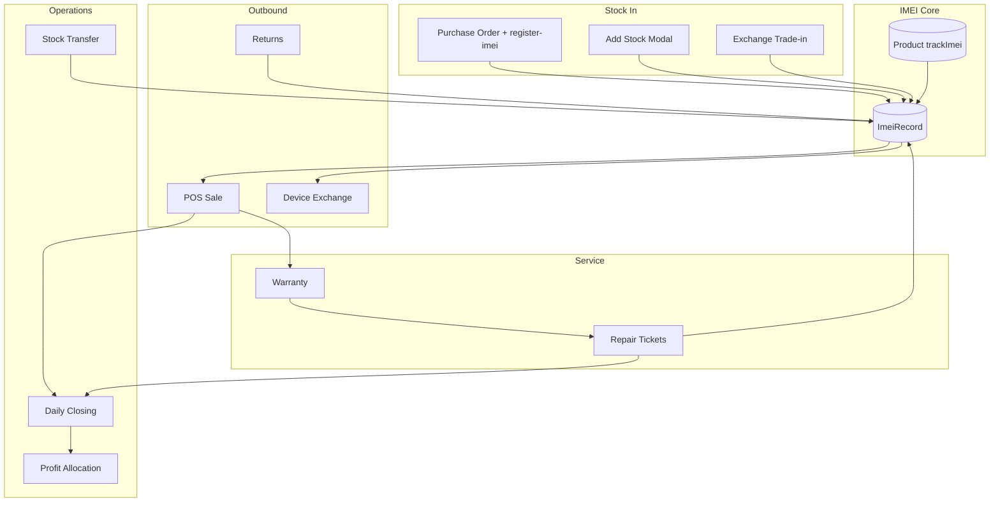

# Hexalyte Mobile System — Full Technical Report
# Hexalyte Mobile System — සම්පූර්ණ Technical Report

> **Generated:** July 2026  
> **Scope:** Complete mobile-phone shop domain — IMEI inventory, POS, repairs, warranty, exchange, stock transfer, reports, finance integration  
> **Repository:** `windsurf-project` (Hexalyte monorepo)

---

## Table of Contents | අන්තර්ගතය

1. [Executive Summary](#1-executive-summary)
2. [Architecture Overview](#2-architecture-overview)
3. [Database Models](#3-database-models)
4. [Backend API Reference](#4-backend-api-reference)
5. [Frontend Pages & Components](#5-frontend-pages--components)
6. [Business Workflows](#6-business-workflows)
7. [Reports & Analytics](#7-reports--analytics)
8. [Feature Flags & Settings](#8-feature-flags--settings)
9. [Finance & Daily Closing Integration](#9-finance--daily-closing-integration)
10. [Multi-Branch Behaviour](#10-multi-branch-behaviour)
11. [Known Gaps & Limitations](#11-known-gaps--limitations)
12. [File Index (Quick Reference)](#12-file-index-quick-reference)

---

## 1. Executive Summary

### English

Hexalyte is built primarily for **mobile phone shops**. The “mobile system” is not a single module — it is a **cross-cutting domain** that spans inventory, POS, IMEI lifecycle, repairs, warranty, device exchange, stock transfer, daily closing, and profit allocation.

**Core principle:** Products with `trackImei = true` (phones/tablets) require a unique 15-digit IMEI at every stock movement — purchase receive, sale, transfer, exchange, and return.

**Mobile revenue classification** uses:
- `Product.trackImei === true`, OR
- Category name matching `/mobile|phone|smartphone|handset/`

This split drives **Daily Closing** (mobile vs accessory sales), **Category Report**, and **Profit Allocation** (Mobile Items / Mobile Profit funds).

### සිංහල

Hexalyte මුලින්ම **mobile phone shops** සඳහා build කරලා තියෙන platform එකක්. “Mobile system” එක එක module එකක් නෙවෙයි — inventory, POS, IMEI, repairs, warranty, exchange, stock transfer, daily closing, profit allocation වගේ **modules ගොඩක් හරහා** spread වෙලා තියෙන domain එකක්.

**මූලික නීතිය:** `trackImei = true` phones/tablets සඳහා stock in/out වෙන හැම වෙලාවකම unique 15-digit IMEI එකක් අනිවාර්යයි.

**Mobile revenue** හඳුනාගන්නේ `trackImei` flag එකෙන් හෝ category name (`Mobile`, `Smartphone`, etc.) එකෙන්.

---

## 2. Architecture Overview



### Tech Stack

| Layer | Path | Technology |
|-------|------|------------|
| Web (shop UI) | `apps/web` | Next.js 15, React, TypeScript |
| Backend API | `apps/backend` | Express, Prisma, PostgreSQL |
| Admin panel | `apps/admin` | Next.js (tenant feature toggles) |
| Schema | `apps/backend/prisma/schema.prisma` | PostgreSQL models |

### API Mount Points (`apps/backend/src/app.ts`)

| Prefix | Module |
|--------|--------|
| `/api/imei` | IMEI CRUD & lookup |
| `/api/products` | Products + IMEI health |
| `/api/repairs` | Repair tickets |
| `/api/warranties` | Warranty & claims |
| `/api/exchanges` | Device exchange |
| `/api/inventory` | Stock transfer |
| `/api/device-catalog` | Brand/model picker |
| `/api/sales` | Sales + returns (IMEI restore) |
| `/api/suppliers` | PO + IMEI registration |
| `/api/analytics` | Dashboard KPIs |
| `/api/daily-closing` | Day close preview & save |
| `/api/profit-allocation` | Fund management |

---

## 3. Database Models

**Schema file:** `apps/backend/prisma/schema.prisma`

### 3.1 Product & IMEI

```
Product
├── trackImei: Boolean          ← marks phone/tablet requiring IMEI
├── warrantyMonths, warrantyNote
├── storageVariations (JSON), colorVariations (JSON)
├── deviceModel, subCategory
├── condition: BRAND_NEW | USED
├── stock (synced from IMEI count when trackImei=true)
└── relations: ImeiRecord[], SaleItem[], RepairSparePart[], Warranty[]

ImeiRecord
├── imei: String @unique        ← globally unique across all tenants
├── productId, branchId
├── variation: String?          ← "128GB::Black" format
├── status: ImeiStatus
├── customerId?, saleId?
├── purchaseOrderId?, poItemId?
└── relations: Product, Branch, Customer, Sale, PurchaseOrder
```

**ImeiStatus enum:**
| Status | Meaning |
|--------|---------|
| `IN_STOCK` | Available for sale |
| `SOLD` | Sold to customer |
| `IN_REPAIR` | Device in repair shop |
| `UNDER_WARRANTY_CLAIM` | Warranty claim active |
| `SCRAPPED` | Written off |

### 3.2 Sales

```
Sale
├── source: POS | REPAIR | EXCHANGE
├── branchId, customerId, invoiceNumber
└── SaleItem
    ├── productId?, imei?, warrantyMonths
    └── quantity (forced to 1 for IMEI lines in POS)
```

### 3.3 Repairs

```
RepairTicket
├── ticketNumber (auto-generated)
├── deviceBrand, deviceModel, deviceColor, imei?
├── status: RECEIVED → DIAGNOSED → IN_REPAIR → QC → READY → DELIVERED | CANCELLED
├── priority: LOW | NORMAL | HIGH | URGENT
├── estimatedCost, finalCost, advancePaid
├── RepairNote[], RepairSparePart[], RepairStatusHistory[]
└── technicianId, customerId, branchId, warrantyClaimId?
```

### 3.4 Warranty

```
Warranty
├── warrantyCode (unique), imei?, saleId?
├── monthsDuration, startDate, endDate
├── qrUrl (public verification link)
└── WarrantyClaim[] (claimType, status, repairTicketId?)
```

### 3.5 Device Exchange

```
DeviceExchange
├── oldBrand, oldModel, oldImei, oldColor, oldStorage, oldCondition
├── exchangeValue (trade-in buy price)
├── soldProductId, newImei, soldVariation
├── balanceAmount, balanceDirection (CUSTOMER_PAYS | SHOP_PAYS)
├── saleId?, invoiceNumber?, tradeInImeiRecordId?
└── tenant, branch, customer
```

### 3.6 Stock Movement

```
StockMovement
├── type: PURCHASE | SALE | TRANSFER_IN | TRANSFER_OUT | ADJUSTMENT | REPAIR_USE | RETURN | EXCHANGE_IN
├── productId, branchId, quantity, reference, performedBy
```

### 3.7 Device Catalog (UI helper, separate from inventory Brand)

```
DeviceBrand → DeviceModel (tenant-scoped picker for repairs/exchange forms)
```

### 3.8 Daily Closing (mobile metrics stored on close)

```
DailyClosing
├── mobileSales, accessorySales
├── repairIncome, repairPartsCogs
├── mobilesSold, imeisRegistered, pendingImeis
├── repairsCompleted, warrantiesActivated
└── reportTypes: DAILY_CLOSING | PROFIT | EXPENSE | RELOAD | CASH | IMEI
```

### Key Migrations

| Migration | Purpose |
|-----------|---------|
| `20250624020000_imei_record_variation` | IMEI variation (storage/color) |
| `20250625120000_imei_purchase_order_link` | PO ↔ IMEI link |
| `20250608140000_repair_device_color` | Repair device color field |

---

## 4. Backend API Reference

### 4.1 IMEI — `/api/imei`

| Method | Endpoint | Description |
|--------|----------|-------------|
| GET | `/` | List IMEI records (+ synthetic `REPAIR_ONLY` unregistered IMEIs from repair tickets) |
| GET | `/lookup/:imei` | Full history: product, sale, customer, repairs, exchanges |
| POST | `/` | Manual IMEI registration (OWNER/MANAGER) |
| PATCH | `/:id/status` | Update IMEI status |

**Service logic:** `apps/backend/src/modules/products/imei.routes.ts`

### 4.2 Products — `/api/products`

| Method | Endpoint | Description |
|--------|----------|-------------|
| GET | `/imei-health` | Stock vs IMEI mismatches, incomplete PO IMEI registration |
| POST | `/bulk-infer-track-imei` | Auto-set `trackImei` from category/name heuristics |

**IMEI inference:** `apps/backend/src/utils/productImei.ts`  
**Stock sync:** `apps/backend/src/utils/product-stock.ts` → `syncImeiTrackedStock()`

### 4.3 Repairs — `/api/repairs`

| Method | Endpoint | Description |
|--------|----------|-------------|
| GET | `/` | List tickets (filters: status, branch, search) |
| POST | `/` | Create ticket |
| GET | `/:id` | Ticket detail |
| PUT | `/:id` | Update ticket |
| POST | `/:id/status` | Advance status |
| POST | `/:id/notes` | Add note |
| POST | `/:id/parts` | Add spare part |
| POST | `/:id/collect-payment` | Deliver + create REPAIR sale + finance income |
| PUT | `/:id/photos` | Upload repair photos |

**Service:** `apps/backend/src/modules/repairs/repairs.service.ts`

### 4.4 Warranty — `/api/warranties`

| Method | Endpoint | Description |
|--------|----------|-------------|
| GET | `/verify/:code` | **Public** — no auth required |
| GET | `/` | List warranties |
| POST | `/` | Create warranty |
| POST | `/:id/claims` | File claim |
| POST | `/:id/email` | Email certificate |

**Service:** `apps/backend/src/modules/warranty/warranty.service.ts`

### 4.5 Exchanges — `/api/exchanges`

| Method | Endpoint | Description |
|--------|----------|-------------|
| GET | `/available-stock` | IN_STOCK IMEI phones for picker |
| POST | `/complete` | Full atomic trade-in + sale transaction |
| GET/POST/PUT/DELETE | `/` | Legacy manual CRUD |

**Service:** `apps/backend/src/modules/exchanges/exchanges.service.ts`

### 4.6 Inventory / Stock Transfer — `/api/inventory`

| Method | Endpoint | Description |
|--------|----------|-------------|
| GET | `/transfers` | Transfer history |
| GET | `/transfer/imeis` | Available IMEIs for transfer (by product + branch) |
| GET | `/transfer/preview` | Preview transfer impact |
| POST | `/transfer` | Execute branch-to-branch transfer |

**Service:** `apps/backend/src/modules/inventory/stock-transfer.service.ts`

### 4.7 Suppliers / PO — `/api/suppliers`

| Method | Endpoint | Description |
|--------|----------|-------------|
| POST | `/purchase-orders/:id/register-imei` | Bulk IMEI registration on PO receive |

### 4.8 Sales Returns — `/api/sales`

| Method | Endpoint | Description |
|--------|----------|-------------|
| POST | `/:id/returns` | Restock product, reset IMEI → IN_STOCK, void warranties |

### 4.9 Device Catalog — `/api/device-catalog`

| Method | Endpoint | Description |
|--------|----------|-------------|
| GET/POST/DELETE | `/brands` | Tenant brand list |
| GET/POST/DELETE | `/models` | Models under brand |

### 4.10 Shared Utilities

| File | Role |
|------|------|
| `utils/productImei.ts` | Infer phone vs accessory from category/name |
| `utils/product-variants.ts` | Storage/color variants, IMEI↔variant matching, transfer counts |
| `utils/product-stock.ts` | Sync `product.stock` = count of IN_STOCK IMEIs |
| `utils/branch-catalog.ts` | Per-branch product copies for multi-branch |
| `finance/category-profit.util.ts` | Mobile vs Accessories revenue split |

---

## 5. Frontend Pages & Components

### 5.1 Main Pages

| Route | File | Purpose |
|-------|------|---------|
| `/dashboard/inventory` | `apps/web/src/app/(dashboard)/inventory/page.tsx` | Product list, add/edit, IMEI health banner |
| `/dashboard/imei` | `apps/web/src/app/(dashboard)/dashboard/imei/page.tsx` | IMEI tracker, lookup, status change |
| `/dashboard/stock-transfer` | `apps/web/src/app/(dashboard)/dashboard/stock-transfer/page.tsx` | Branch transfer with IMEI picker |
| `/dashboard/repairs` | `apps/web/src/app/(dashboard)/repairs/page.tsx` | Full repair workflow UI (~2400 lines) |
| `/dashboard/warranty` | `apps/web/src/app/(dashboard)/warranty/page.tsx` | Warranty list & claims |
| `/dashboard/exchanges` | `apps/web/src/app/(dashboard)/dashboard/exchanges/page.tsx` | Device exchange wizard |
| `/dashboard/daily-closing` | `apps/web/src/app/(dashboard)/dashboard/daily-closing/page.tsx` | Day close with mobile/IMEI metrics |
| `/dashboard/profit-allocation` | `apps/web/src/app/(dashboard)/dashboard/profit-allocation/page.tsx` | Mobile Items/Profit funds |
| `/dashboard/purchase-invoice` | `apps/web/src/app/(dashboard)/purchase-invoice/page.tsx` | PO receive + IMEI registration |
| `/dashboard/category-report` | Category profit breakdown incl. Mobile |
| `/dashboard/reports` | Sales, P&L, Repairs, Inventory tabs |
| `/dashboard/analytics` | KPIs: active repairs, expiring warranties |
| `/warranty/verify/[code]` | `apps/web/src/app/warranty/verify/[code]/page.tsx` | **Public** warranty verification |

### 5.2 Key Components

| Component | Path | Role |
|-----------|------|------|
| POS overlay | `components/pos/POSOverlay.tsx` | IMEI scan, warranty, cart |
| Cart rules | `components/pos/cart-rules.ts` | IMEI qty=1, warranty validation |
| POS features | `components/pos/pos-features.ts` | Feature-gated nav items |
| Add product | `components/inventory/AddProductModal.tsx` | Phone vs accessory type |
| IMEI type selector | `components/inventory/ImeiProductTypeSelector.tsx` | trackImei toggle UI |
| Add stock | `components/inventory/AddStockModal.tsx` | Bulk IMEI entry, Excel import |
| Exchange wizard | `components/exchanges/ExchangeWizard.tsx` | Multi-step trade-in flow |
| Exchange stock picker | `components/exchanges/ExchangeStockPicker.tsx` | IN_STOCK IMEI picker |
| Warranty certificate | `components/invoice/WarrantyCertificate.tsx` | Print/email warranty |
| Thermal receipt | `components/invoice/ThermalReceipt.tsx` | IMEI on receipt lines |
| Sidebar | `components/layout/Sidebar.tsx` | Feature-gated navigation |
| Returns modal | `components/pos/PosReturnModal.tsx` | Sale return + IMEI restore |

### 5.3 Client Libraries

| File | Role |
|------|------|
| `lib/api.ts` | `imeiApi`, `repairsApi`, `warrantyApi`, `exchangesApi`, `deviceCatalogApi`, `inventoryApi` |
| `lib/productImei.ts` | Frontend IMEI type inference (mirrors backend) |
| `lib/hooks.ts` | `useImeiRecords`, `useRepairs`, `useFeatureFlag` |
| `lib/exchangeBill.ts` | Exchange receipt formatting |
| `lib/daily-closing-export.ts` | Excel export with Mobile + IMEI sheets |
| `lib/productCsvImport.ts` | CSV import with `trackImei` column |
| `types/index.ts` | `ImeiRecord`, `RepairTicket`, `Warranty` types |

---

## 6. Business Workflows

### 6.1 Product Setup (Phone vs Accessory)

1. User selects **Phone/Tablet** or **No IMEI** via `ImeiProductTypeSelector`.
2. System infers type from category (`Mobiles`, `Smartphone`), `deviceModel` (iPhone, Samsung…), or storage/color variants.
3. `trackImei` saved on `Product`.
4. For IMEI products, `stock` auto-syncs from `IN_STOCK` IMEI count.

### 6.2 Stock In (3 paths)

| Path | How | API |
|------|-----|-----|
| Manual | Add Stock modal — scan/type IMEI | `POST /api/imei` |
| Purchase Order | Receive PO → register IMEIs per line | `POST /api/suppliers/purchase-orders/:id/register-imei` |
| Exchange trade-in | Old phone received as stock | `POST /api/exchanges/complete` (EXCHANGE_IN movement) |

### 6.3 POS Sale (IMEI Phone)

```
1. Add product to cart
2. If trackImei → scan IMEI or pick from variant dropdown
3. Cart enforces qty = 1 per IMEI line
4. Checkout validates: IMEI registered, IN_STOCK, correct branch
5. On sale: ImeiRecord → SOLD, linked to saleId + customerId
6. If warrantyMonths > 0 + customer → auto-create Warranty with QR
```

### 6.4 Repair Workflow

```
RECEIVED → DIAGNOSED → IN_REPAIR → QC → READY → DELIVERED
         (or CANCELLED at any stage)
```

| Step | Action |
|------|--------|
| Create | Customer phone required; auto-creates customer if new |
| IMEI | If provided → ImeiRecord status `IN_REPAIR` |
| Work | Add notes, photos, spare parts (inventory products) |
| Deliver | `collect-payment` → Sale (source: REPAIR) + Finance INCOME + spare part stock decrement |
| Warranty | Claims can link to repair via `warrantyClaimId` |

### 6.5 Warranty Lifecycle

1. Auto-created on POS sale (IMEI required for tracked products).
2. Customer verifies at `/warranty/verify/:code` (public, no login).
3. Shop files claim → can link repair ticket.
4. On sale return → warranties voided, IMEI restored to IN_STOCK.

### 6.6 Device Exchange

```
ExchangeWizard steps:
1. Capture trade-in (brand, model, IMEI, storage, color, condition, buy price)
2. Pick sold phone from available IN_STOCK IMEI inventory
3. POST /exchanges/complete (atomic):
   - Trade-in → new ImeiRecord IN_STOCK
   - Sold IMEI → SOLD
   - Sale (source: EXCHANGE) with trade-in as discount
   - DeviceExchange record + warranties for sold device
4. Print receipt/invoice
```

### 6.7 Stock Transfer (Multi-Branch)

1. OWNER/MANAGER selects from/to branch, product, variant.
2. IMEI products: pick specific IMEIs (`GET /inventory/transfer/imeis`).
3. Transfer moves `ImeiRecord.branchId`, creates branch catalog copy if needed.
4. Stock movements: `TRANSFER_OUT` + `TRANSFER_IN`.

### 6.8 Sale Returns

- `POST /api/sales/:id/returns`
- Restocks product quantity
- Resets IMEI → `IN_STOCK`
- Voids linked warranties

---

## 7. Reports & Analytics

### 7.1 Dedicated Mobile / IMEI Views

| Report | Location | Content |
|--------|----------|---------|
| **IMEI Tracker** | `/dashboard/imei` | All IMEI records, lookup, status filter, history |
| **IMEI Health** | `/dashboard/inventory` (banner) | Stock vs IMEI count mismatches, incomplete PO IMEIs |
| **Daily Closing** | `/dashboard/daily-closing` | Mobile sales, accessory sales, IMEI summary, repair income |
| **Daily Closing Excel** | Export button on daily closing | Sheets: Summary, Mobile Sales, IMEI metrics |
| **Category Report** | `/dashboard/category-report` | Mobile vs Accessories revenue & profit |
| **Profit Allocation** | `/dashboard/profit-allocation` | Mobile Items, Mobile Profit, Repair % funds |

### 7.2 Reports Page (`/dashboard/reports`)

| Tab | Mobile-related content |
|-----|------------------------|
| **Overview** | Active repairs count, revenue KPIs |
| **Sales** | All POS sales (includes mobile lines with IMEI) |
| **P&L Report** | Category breakdown incl. Mobile |
| **Inventory** | Stock levels (IMEI products show synced stock) |
| **Repairs** | Status breakdown chart + CSV export (`repairs-report.csv`) |
| **Daily Reload** | Telecom reload (adjacent, not handset inventory) |

### 7.3 Analytics Dashboard (`/dashboard/analytics`)

| KPI | Source |
|-----|--------|
| Active repairs | `repairTicket.count` (not DELIVERED/CANCELLED) |
| Ready for pickup | `status = READY` |
| Expiring warranties | Warranties ending within 30 days |
| POS revenue | Sales excluding repair-source double-count |

**API:** `GET /api/analytics/overview`, `GET /api/analytics/repairs-by-status`

### 7.4 Daily Closing — Mobile Metrics

Stored on day close (`DailyClosing` model):

| Field | Description |
|-------|-------------|
| `mobileSales` | Revenue from mobile products (trackImei or category heuristic) |
| `accessorySales` | Non-mobile product revenue |
| `mobilesSold` | Count of IMEI phones sold today |
| `imeisRegistered` | New IMEIs registered today |
| `pendingImeis` | PO items awaiting IMEI registration |
| `repairIncome` | Finance income category "Repairs" |
| `repairPartsCogs` | Spare parts cost on delivered repairs |
| `repairsCompleted` | Tickets moved to DELIVERED today |
| `warrantiesActivated` | New warranties created today |

**Excel export sheets** (`lib/daily-closing-export.ts`):
- Summary (mobile/accessory split)
- Mobile Sales detail
- IMEI metrics (registered, sold, pending)

### 7.5 What Is NOT Available (gaps)

| Missing report | Notes |
|----------------|-------|
| Dedicated exchange report | Only on exchange page + IMEI lookup history |
| Standalone IMEI analytics page | Beyond IMEI tracker tab |
| Mobile sales by brand/model report | Partial via category report only |
| Warranty claims report | Warranty page only, no aggregated report tab |
| Repair technician performance | No dedicated report |
| IMEI aging report | How long units sit in stock |

---

## 8. Feature Flags & Settings

**Definition:** `apps/backend/src/modules/tenants/tenant-features.ts`

| Feature | Default | Mobile relevance |
|---------|---------|------------------|
| `POS` | ON | IMEI scan at sale, mobile checkout |
| `IMEI` | ON | IMEI tracker nav, POS IMEI tab |
| `REPAIRS` | ON | Repair job management |
| `WARRANTY` | ON | Warranty module + POS auto-warranty |
| `EXCHANGES` | ON | Device trade-in/exchange |
| `SUPPLIERS` | ON | PO + IMEI registration on receive |
| `SERVICES` | ON | Service income (print/laminate etc.) |
| `DAILY_CLOSING` | OFF (opt-in) | Mobile sales split, IMEI summary on close |
| `PROFIT_ALLOCATION` | OFF (opt-in) | Mobile Items / Mobile Profit funds |
| `DAILY_RELOAD` | OFF (opt-in) | Telecom reload commission (not handset) |
| `ANALYTICS` | ON | Repair KPIs on dashboard |
| `REPORTS` | ON | Repairs tab, sales reports |

**Gating:** Frontend uses `useFeatureFlag()` in Sidebar, POS, and page guards.  
**Note:** Backend API routes for IMEI/repairs/exchanges do **not** enforce feature flags — disabled features hide UI only.

**Invoice settings:** `apps/backend/src/modules/tenants/invoice-settings.util.ts`
- Warranty terms text on bills
- Thermal receipt IMEI line toggle
- Shop legal name, address, logo

---

## 9. Finance & Daily Closing Integration

### 9.1 Mobile Revenue Classification

```typescript
// apps/backend/src/modules/finance/category-profit.util.ts
function isMobileProduct(product) {
  if (product.trackImei) return true
  const cat = category name + slug (lowercase)
  return /mobile|phone|smartphone|handset/.test(cat)
}
```

Categories built: **Mobile**, **Accessories**, **Services**, **Print**, **Other**

### 9.2 Profit Allocation Default Funds

| Fund | Type | Source |
|------|------|--------|
| Mobile Items | MANUAL | Mobile category revenue |
| Mobile Profit | MANUAL | Mobile category profit |
| Repair | PERCENTAGE (5%) | Repair income |
| Rent, Bills, Salary, etc. | FIXED/PERCENTAGE | Standard allocation |

Auto-filled from `buildCategoryCostMap()` + daily closing preview.

### 9.3 Daily Closing — Avoiding Double Count

- POS sales with `source: REPAIR` excluded from POS revenue buckets
- Repair income counted separately from Finance transactions (category: Repairs)
- Reload sales excluded from mobile/accessory split (handled by Daily Reload module)

### 9.4 Repair Payment Flow

```
collect-payment on DELIVERED
  → Sale (source: REPAIR)
  → Finance Transaction (INCOME, category: Repairs)
  → Spare parts: stock decrement + REPAIR_USE movement
```

---

## 10. Multi-Branch Behaviour

| Area | Behaviour |
|------|-----------|
| **Products** | HQ catalog + per-branch copies via `branch-catalog.ts` |
| **IMEI records** | Each IMEI tied to `branchId` — transfer moves branch |
| **POS sale** | IMEI must be IN_STOCK at active branch |
| **Stock transfer** | OWNER/MANAGER; IMEI picker per unit |
| **Repairs** | Per-branch tickets |
| **Daily closing** | Per-branch day close |
| **Profit allocation** | Per-branch funds |
| **Reports** | Branch filter on analytics/reports |

**Active branch:** Selected via header branch switcher; stored in session, sent as `X-Branch-Id` header.

---

## 11. Known Gaps & Limitations

| # | Gap | Impact |
|---|-----|--------|
| 1 | No single `mobile` module | Logic spread across many files — harder onboarding |
| 2 | Backend feature flags not enforced | APIs work even if tenant feature disabled |
| 3 | IMEI globally `@unique` | Same physical device in two tenants would collide |
| 4 | `DeviceBrand`/`DeviceModel` vs inventory `Brand` | Two parallel brand catalogs |
| 5 | Repair spare parts not reserved | Stock only decrements on payment collection |
| 6 | Repair status UI mismatch | Frontend labels (`DIAGNOSING`) vs backend enum (`DIAGNOSED`) |
| 7 | Synthetic `REPAIR_ONLY` IMEI status | API-only, not in DB enum — confuses filters |
| 8 | No dedicated exchange report | History only via exchange page + IMEI lookup |
| 9 | Dual IMEI field in Add Stock UI | `imei2` shown but typically only `imei1` registered |
| 10 | `bulkInferTrackImei` not automatic | Accessories may be miscategorized if `trackImei` wrong |
| 11 | Stock Transfer not feature-flagged | Always visible in sidebar |
| 12 | Legacy exchange CRUD vs `/complete` | Two code paths for exchanges |

---

## 12. File Index (Quick Reference)

### Backend

```
apps/backend/prisma/schema.prisma
apps/backend/src/modules/products/imei.routes.ts
apps/backend/src/modules/products/products.routes.ts
apps/backend/src/modules/products/products.service.ts
apps/backend/src/modules/repairs/repairs.routes.ts
apps/backend/src/modules/repairs/repairs.service.ts
apps/backend/src/modules/warranty/warranty.routes.ts
apps/backend/src/modules/warranty/warranty.service.ts
apps/backend/src/modules/exchanges/exchanges.routes.ts
apps/backend/src/modules/exchanges/exchanges.service.ts
apps/backend/src/modules/inventory/stock-transfer.routes.ts
apps/backend/src/modules/inventory/stock-transfer.service.ts
apps/backend/src/modules/device-catalog/device-catalog.routes.ts
apps/backend/src/modules/sales/sales.service.ts
apps/backend/src/modules/daily-closing/daily-closing.service.ts
apps/backend/src/modules/profit-allocation/profit-allocation.service.ts
apps/backend/src/modules/finance/category-profit.util.ts
apps/backend/src/modules/analytics/analytics.routes.ts
apps/backend/src/utils/productImei.ts
apps/backend/src/utils/product-variants.ts
apps/backend/src/utils/product-stock.ts
apps/backend/src/utils/branch-catalog.ts
```

### Frontend

```
apps/web/src/app/(dashboard)/inventory/page.tsx
apps/web/src/app/(dashboard)/dashboard/imei/page.tsx
apps/web/src/app/(dashboard)/dashboard/stock-transfer/page.tsx
apps/web/src/app/(dashboard)/repairs/page.tsx
apps/web/src/app/(dashboard)/warranty/page.tsx
apps/web/src/app/(dashboard)/dashboard/exchanges/page.tsx
apps/web/src/app/(dashboard)/dashboard/daily-closing/page.tsx
apps/web/src/app/(dashboard)/dashboard/profit-allocation/page.tsx
apps/web/src/app/(dashboard)/reports/page.tsx
apps/web/src/app/(dashboard)/analytics/page.tsx
apps/web/src/app/warranty/verify/[code]/page.tsx
apps/web/src/components/pos/POSOverlay.tsx
apps/web/src/components/pos/cart-rules.ts
apps/web/src/components/inventory/AddProductModal.tsx
apps/web/src/components/inventory/AddStockModal.tsx
apps/web/src/components/exchanges/ExchangeWizard.tsx
apps/web/src/lib/api.ts
apps/web/src/lib/daily-closing-export.ts
apps/web/src/lib/productImei.ts
```

### Related Docs

| Doc | Path |
|-----|------|
| System guide (EN + SI) | `docs/HEXALYTE_SYSTEM_GUIDE_EN_SI.md` |
| User manual (EN + SI) | `docs/HEXALYTE_USER_MANUAL_EN_SI.md` |
| This report | `docs/MOBILE_SYSTEM_REPORT.md` |

---

*End of report. For operational how-to steps, see `docs/HEXALYTE_SYSTEM_GUIDE_EN_SI.md`. For end-user instructions, see `docs/HEXALYTE_USER_MANUAL_EN_SI.md`.*
